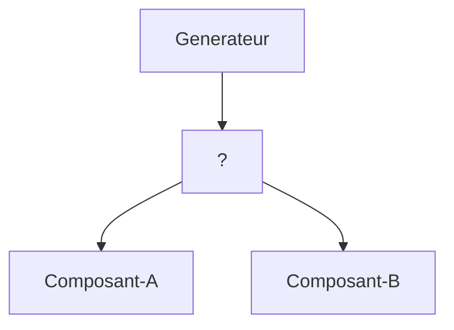

# React

---

## L'UI vue comme un arbre

<br>


<br>

React crée un arbre de l'UI à partir de vos composants.

Avec un rendu conditionnel, l'arbre peut différer entre les composants :

```jsx
function Generateur() {
  return <div>{data ? <Composant A /> : <Composant B />}</div>;
}
```

<br>


