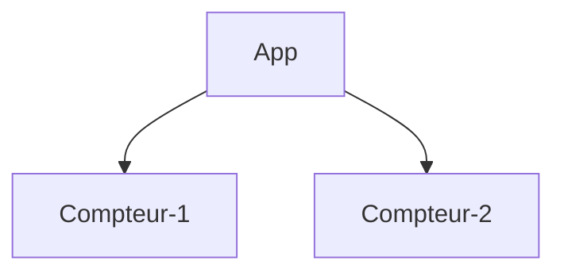

# React

---

## Partager des données entre les composants

Vous aurez régulièrement besoin que vos composants partagent des données et se mettent à jour de façon synchronisée.

1. Déplacer l'état dans le composant parent qui héberge ces composants le plus proche :



2. Passer le gestionnaire d'événement en props pour les deux composants enfants :

```jsx
function App() {
  const [count, setCount] = useState(0);

  function handleClick() {
    setCount(count + 1);
  }

  return (
    <>
      <h1>{count}</h1>
      <Compteur onClick={handleClick} />
      <Compteur onClick={handleClick} />
    </>
  );
}
```

3. Lire la prop passé par le composant parent dans le composant enfant :

```jsx
function Compteur({ onClick }) {
  return <button onClick={onClick}>Cliquez ici</button>;
}
```

C'est ce qu'on appelle "lifting state up" ou "faire remonter l'état" en déplacant l'état vers le haut pour le partager aux composants enfants.
