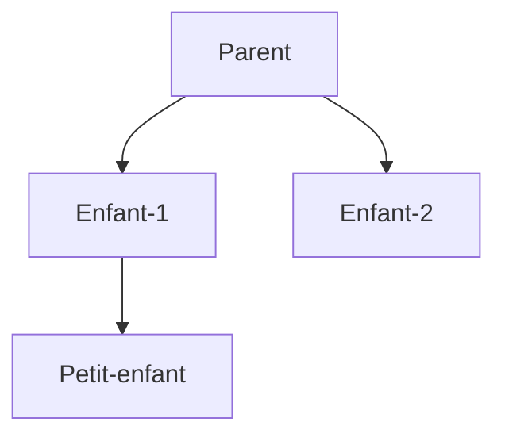

# React

---

## Penser en React

1. **Décomposer** l'UI désirée en une hiérarchie de composants.

- Commencer par dessiner des boites autour de chaque composants et sous-composants sur une maquette et les nommer :

 

2. **Construire** une version statique en React.

- Fabriquer les composants qui réutilisent d'autres composants et leur passer des données grâce aux props.

- Ne pas utiliser d'état car il est réservé à l'intéractivité.

 

3. **Trouver** une représentation minimale de l'état pour l'UI.

- Réfléchir à toute les données dans cette application, qu'est ce qui _constitue l'état_ et identifier ce qui n'en est pas.

 

4. **Identifier** où l'état devrait vivre.

- Sur chaque composant qui affiche quelque chose sur base de cet état.
- _Trouver_ leur plus propre ancêtre commun.
- _Décider_ où l'état actuel devrait vivre.

 

5. **Ajouter** un flux de données inverse

- Les composants enfants auront besoin de mettre à jour les états des composants parents avec des props ainsi que des gestionnaires d'événements.
